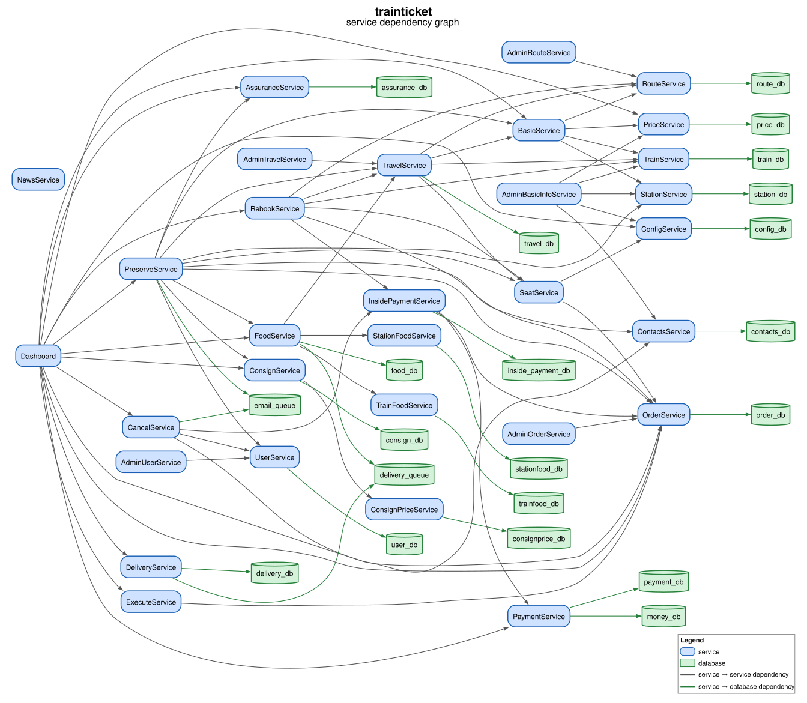

# App Diagram

Draws the service dependency graph of an app from the `output/{app}/app.json` that Aletheia writes when it analyzes the app:

- **Services** are blue boxes
- **Databases** are green cylinders
- **Edges** are service → service dependencies (grey) and service → database dependencies (green)

## Example

The service dependency graph of `trainticket`:



The [examples](examples/) folder has the diagram of every app in `output/`. To update them after changing the script, run it on every app and copy each diagram into the folder:

```zsh
go run ./scripts/app-diagram -format svg
for d in output/*/diagrams; do cp $d/app.svg scripts/app-diagram/examples/$(basename $(dirname $d)).svg; done
```

## Requirements

- An `output/{app}/app.json`. If it's missing, analyze the app first (e.g., `./bin/aletheia trainticket`).
- [Graphviz](https://graphviz.org/download/) to draw the image (`brew install graphviz` on macOS, `apt install graphviz` on Debian/Ubuntu). Without it, the script prints a warning and only writes the `.dot` file.

## Running

From the repository root:

```zsh
go run ./scripts/app-diagram trainticket               # a single app
go run ./scripts/app-diagram trainticket sockshop      # several apps
go run ./scripts/app-diagram -format svg trainticket   # svg or pdf instead of png
go run ./scripts/app-diagram -dpi 600 trainticket      # sharper png (default: 300 dpi)
go run ./scripts/app-diagram                           # every app with an output/{app}/app.json
```

## Output

For each app, the script writes to `output/{app}/diagrams/`:

- `app.dot`: the graph in Graphviz format.
- `app.{format}`: the rendered image (`app.png` by default). PNGs and other bitmap formats are drawn at 300 dpi, or the value of `-dpi`. SVG and PDF are vector formats, so they ignore `-dpi` and stay sharp at any zoom.

To redraw the image after editing `app.dot` by hand:

```zsh
dot -Tpng -Gdpi=300 output/trainticket/diagrams/app.dot -o output/trainticket/diagrams/app.png
```

`make verify` replaces `output/{app}/` for every app it checks, which deletes `diagrams/`, so run the script again afterwards.

## Notes

- Queues (e.g., `email_queue`) are listed as databases in `app.json`, so they are drawn as databases.
- The per-service `databases` list in `app.json` is currently always empty, so the script finds service → database dependencies from each service's `fields` instead. For example, a field `db #0 (assurance_db)` links the service to `assurance_db`, because `assurance_db` is in the app's top-level `databases` list.
