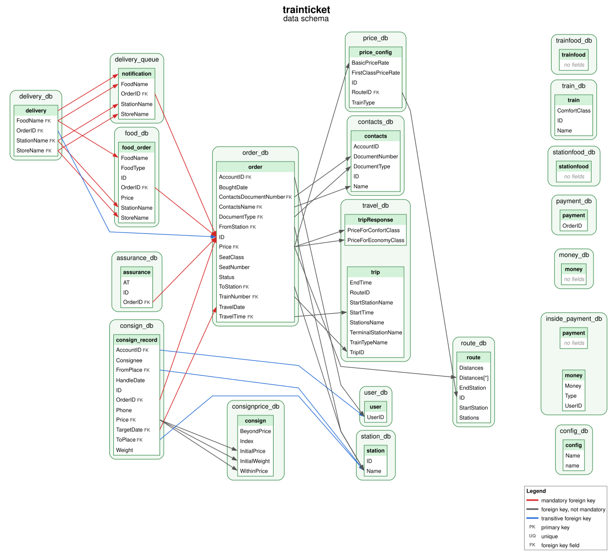

# Schema Diagram

Draws the data schema of an app from the `output/{app}/schema.json` that Aletheia writes when it analyzes the app:

- **Databases** are green boxes that group their tables
- **Tables** list their fields, marked `PK` (primary key), `UQ` (unique) or `FK` (foreign key)
- **Edges** are foreign keys, from the referencing field to the referenced field: red if mandatory, grey if not, and blue if transitive. See [Reading the Output](../../README.md#reading-the-output) for what these mean

## Example

The data schema of `trainticket`:



The [examples](examples/) folder has the diagram of every app in `output/`. To update them after changing the script, run it on every app and copy each diagram into the folder:

```zsh
go run ./scripts/schema-diagram -format svg
for d in output/*/diagrams; do cp $d/schema.svg scripts/schema-diagram/examples/$(basename $(dirname $d)).svg; done
```

## Requirements

- An `output/{app}/schema.json`. If it's missing, analyze the app first (e.g., `./bin/aletheia trainticket`).
- [Graphviz](https://graphviz.org/download/) to draw the image (`brew install graphviz` on macOS, `apt install graphviz` on Debian/Ubuntu). Without it, the script prints a warning and only writes the `.dot` file.

## Running

From the repository root:

```zsh
go run ./scripts/schema-diagram trainticket               # a single app
go run ./scripts/schema-diagram trainticket sockshop      # several apps
go run ./scripts/schema-diagram -format svg trainticket   # svg or pdf instead of png
go run ./scripts/schema-diagram -dpi 600 trainticket      # sharper png (default: 300 dpi)
go run ./scripts/schema-diagram                           # every app with an output/{app}/schema.json
```

## Output

For each app, the script writes to `output/{app}/diagrams/`:

- `schema.dot`: the graph in Graphviz format.
- `schema.{format}`: the rendered image (`schema.png` by default). PNGs and other bitmap formats are drawn at 300 dpi, or the value of `-dpi`. SVG and PDF are vector formats, so they ignore `-dpi` and stay sharp at any zoom.

To redraw the image after editing `schema.dot` by hand:

```zsh
dot -Tpng -Gdpi=300 output/trainticket/diagrams/schema.dot -o output/trainticket/diagrams/schema.png
```

`make verify` replaces `output/{app}/` for every app it checks, which deletes `diagrams/`, so run the script again afterwards.

## Notes

- Databases without tables in `schema.json` are not drawn. The script lists them when it runs.
- A constraint in `schema.json` can name a field that is missing from its table's `fields` list. The script still adds that field to the table so the constraint can be drawn. Constraints on a table that is not in `schema.json` are skipped with a warning.
